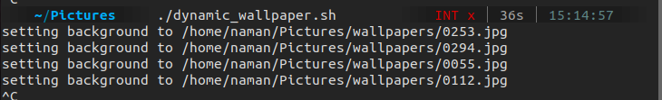

# Dynamic Wallpaper

## Table of Contents

- [About](#about)
- [Usage](#usage)
- [Screenshots](#ss)

## About <a name = "about"></a>
Simple customizable bash script to rotate downloaded wallpapers from folder after a given interval of time.

### Prerequisites:

Working on linux systems having Gnome based desktop environments(eg: Ubuntu): 

```
git clone https://github.com/shadyskies/django-projects.git
```

## Usage <a name = "usage"></a>
```
chmod +x dynamic_wallpaper.sh
./dynamic_wallpaper.sh
```
## Screenshots <a name = "ss"></a>

