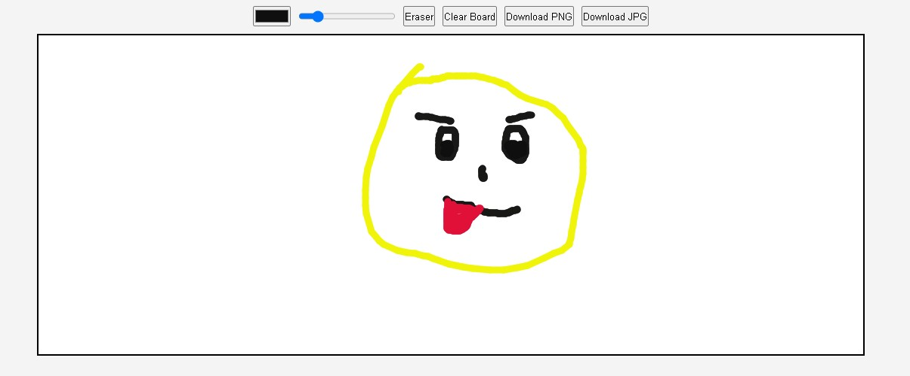

# Mini Paint
mini-paint folder with HTML, CSS, and JS files. which creates a webpage having the paint application with features like selecting a color, brush size, and eraser, clearing the board completely, downloading the drawn image in PNG or JPG format.

## Features

- **Color Selection**: Choose your preferred drawing color.
- **Brush Size**: Adjust the size of the brush for detailed or broad strokes.
- **Eraser Tool**: Erase parts of your drawing with ease.
- **Fill Color**: Use the fill tool to color a specific area by clicking on it.
- **Clear Board**: Reset the entire canvas to start a new drawing.
- **Download Artwork**: Save your creation as a PNG or JPG image file.

## Usage

1. Launch the application by opening the `index.html` file in a modern web browser.
2. Use the provided tools to create your artwork:
   - Select a color and brush size for drawing.
   - Use the eraser tool to remove unwanted parts.
    - Use the fill tool to color specific areas.
   - Clear the board to start afresh.
   - Save your artwork by downloading it as a PNG or JPG file.

Enjoy painting with Mini Paint! 
