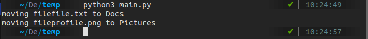

# Folder Sorter

## Table of Contents

- [About](#about)
- [Usage](#usage)
- [Screenshots](#ss)

## About <a name = "about"></a>
Organize your cluttered directory into folders with this automated script. 

### Prerequisites:
Python should be installed

## Usage <a name = "usage"></a>
```
python3 main.py
```
## Screenshots <a name = "ss"></a>

