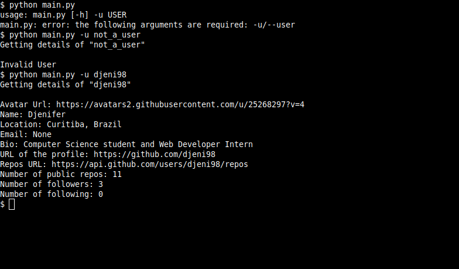
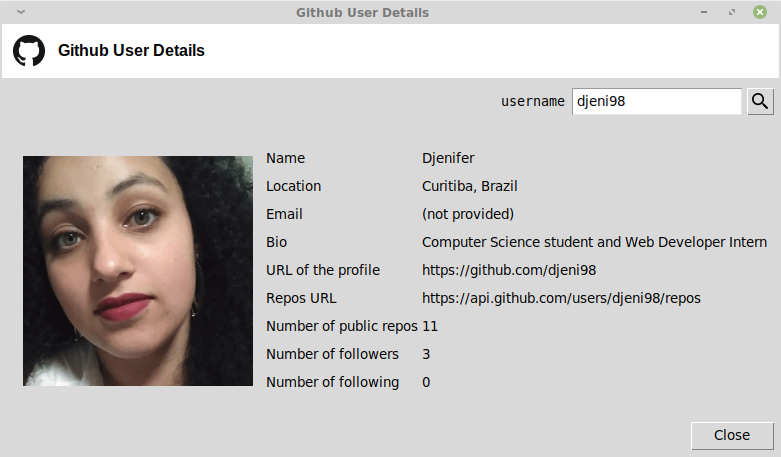

# Github User Details

Get the details of a user using Github API.


## Install

This project needs a few python packages. So you may need
to install it.


```sh
$ pip install -r requirements.txt
```

## Run
> Make sure to use Python 3. This code does not support Python 2

### CLI

To search for an user, pass it as an argument in command line.

```
$ python main.py -u <username>
```

### GUI

There is no arguments to run with gui.

```
$ python gui.py
```

## Examples

### CLI



### GUI


