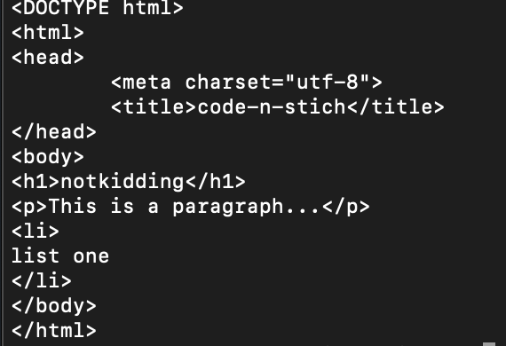
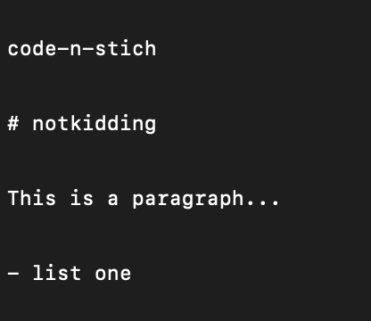

# HTML TO Markdown
### _Automation script to convert html conent to markdown._
## Installation
The script needs a few modules to run.
To install these modules run:
`pip install requirements.txt`
or
`pip3 install requirements.txt`

To run the program do:
`python main.py`
or
`python3 main.py`

To Terminate the program do:
`ctrl + c`

### Example

Input:

Output:

