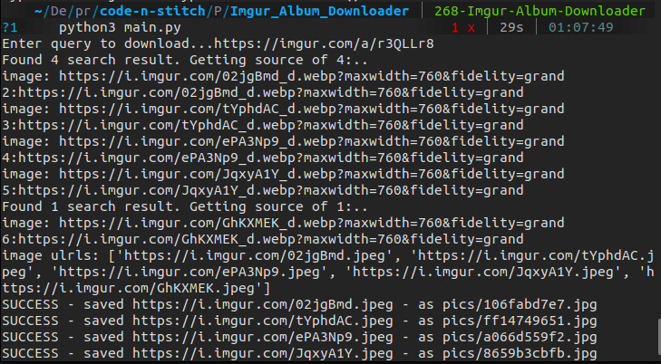

# Imgur Album Downloader

## Table of Contents

- [About](#about)
- [Usage](#usage)
- [Screenshots](#ss)

## About <a name = "about"></a>
Download all images in an imgur album by just putting in album url link.

## Prerequisites:
Python and necessary libraries need to be installed

## Usage <a name = "usage"></a>
```
pip3 install -r requirements.txt
```
```
python3 main.py
```
## Screenshots <a name = "ss"></a>

