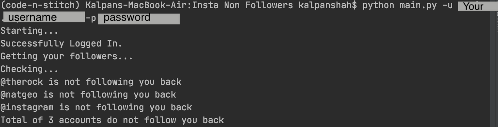
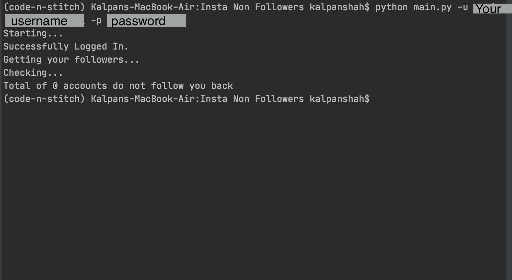

# Instagram Non Followers

Check your Instagram Account who do not follow you back


## Install

This project needs a few python packages. So you may need
to install it.


```sh
$ pip install -r requirements.txt
```

## Run


You will need your username and password 

```
$ python main.py -u "your username" -p "your password"
```
> Note: Remember don't use it repeatedly 

## All Arguments
Command | Description
------------ | -------------
--username or -u | Your Username
--password or -p | Your Password
--max-following-check or -m | Max number of account to check (default: 1000)


## Example 1



## Example 2



