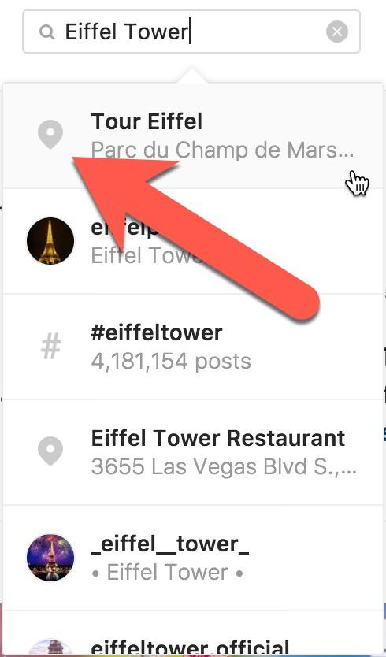
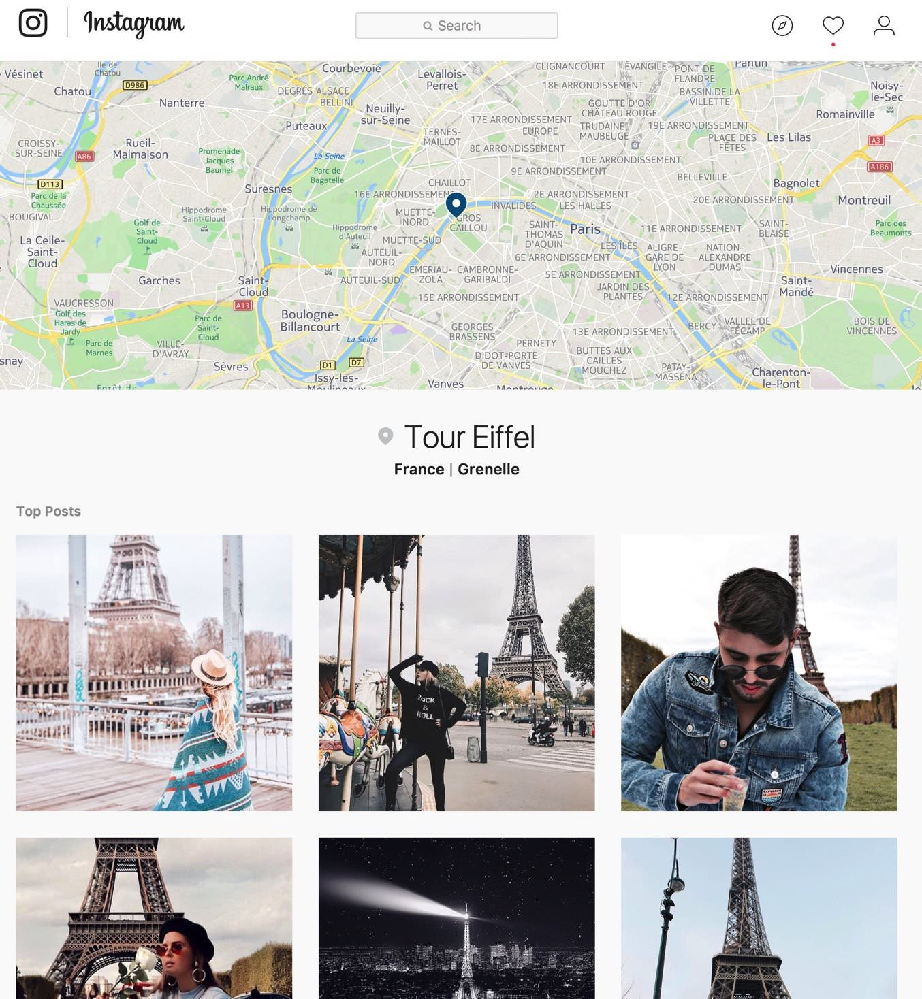
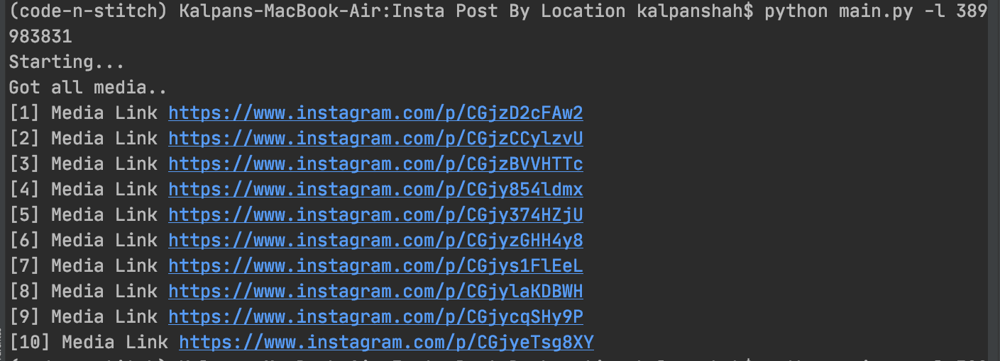
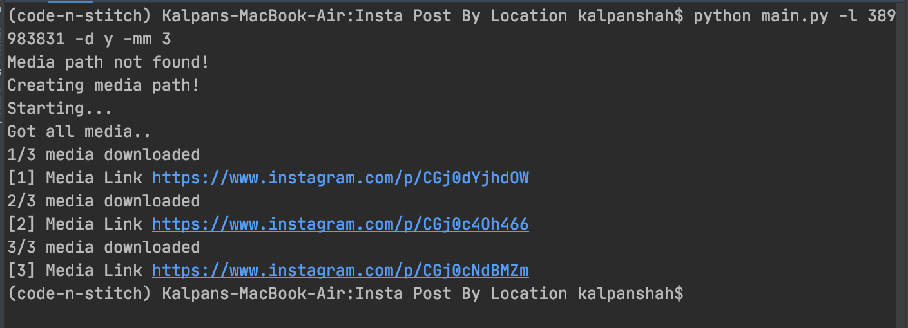

# Get top instagram post via location

Download / Get  the top instagram medias from the Location


## Install

This project needs a few python packages. So you may need
to install it.


```sh
$ pip install -r requirements.txt
```
## How to get location id 
Follow this simple 4 step to get instagram location id

### Step 1
Log into the Instagram website (instagram.com) using a web browser

### Step 2
 Search for a Location
 <br />


### Step 3

Open Location Page
<br />


### Step 4

Copy Location ID
<br />


## Run


To download media pass a tag it as an argument in command line.

```
$ python main.py -l <valid location id>
```
 

## More Arguments
Command | Function
------------ | -------------
--location-id | Location ID
--download | If you also want to download image either `y` or `n`
--path | Path to save media
--max-media | Max number of media to download
--media-type | Preferred Media Type (`image` or `video` or `all`)
--quality | Media Quality Use either of `low`, `standard` or `high`


## Examples






