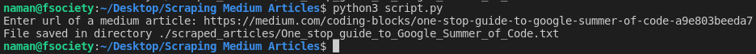

# Scraping Medium Articles
This script asks the user for the url of a medium article, scrapes it's text and saves it to a text file into a folder named scraped_articles in the same directory.
 (There are 3 text files in the folder scraped_articles as an example of how the article is scraped)

## Prerequisites
`pip` install the modules given in requirements.txt
 Have a working network connection on the device

## How to run the script

## Author
[Naman Shah](https://github.com/namanshah01)
