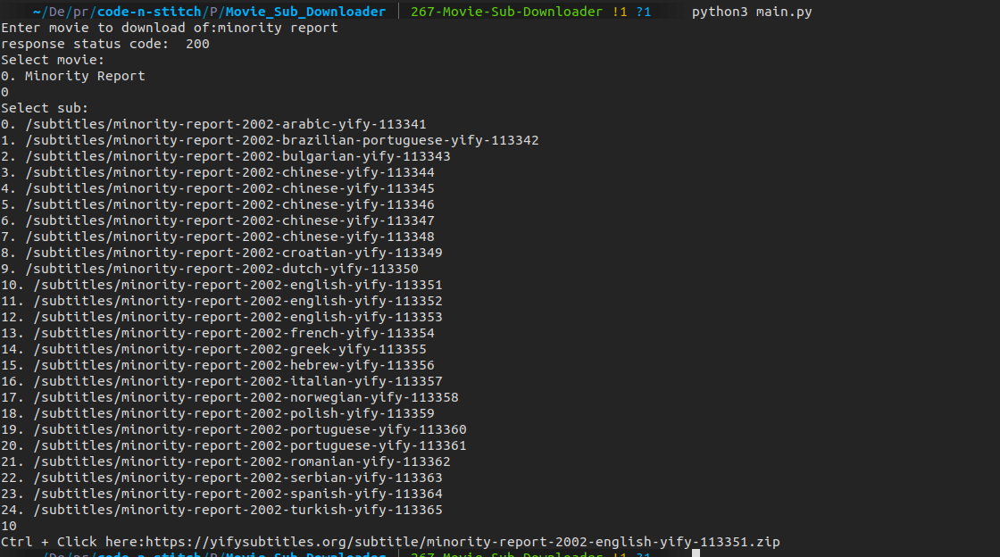

# Movie Subs Downloader

## Table of Contents

- [About](#about)
- [Usage](#usage)
- [Screenshots](#ss)

## About <a name = "about"></a>
Automated script to get the link for downloading subtitle of any movie. User can Ctrl + Click on the link displayed in terminal to download directly from the browser.

## Prerequisites:
Python and necessary libraries need to be installed

## Usage <a name = "usage"></a>
```
pip3 install -r requirements.txt
```
```
python3 main.py
```
## Screenshots <a name = "ss"></a>

