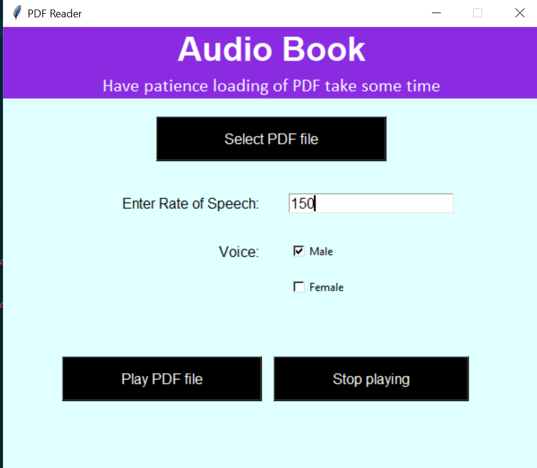

# Audio Book

-   To Get started with this project first install all required library using:

```
pip install -r requirements.txt
```

### Main Library used in this project are:

-   Tkinter for the GUI
-   Simple code to get started with [Tkinter](https://docs.python.org/3/library/tkinter.html)

```python
import tkinter as tk

class Application(tk.Frame):
    def __init__(self, master=None):
        super().__init__(master)
        self.master = master
        self.pack()
        self.create_widgets()

    def create_widgets(self):
        self.hi_there = tk.Button(self)
        self.hi_there["text"] = "Hello World\n(click me)"
        self.hi_there["command"] = self.say_hi
        self.hi_there.pack(side="top")

        self.quit = tk.Button(self, text="QUIT", fg="red",
                              command=self.master.destroy)
        self.quit.pack(side="bottom")

    def say_hi(self):
        print("hi there, everyone!")

root = tk.Tk()
app = Application(master=root)
app.mainloop()
```

-   PyPDF2 is a Pdf toolkit that is used for Extracting document information (title, author, …) etc
-   Simple code to get started with [PyPDF2](https://pypi.org/project/PyPDF2/)

```python
from PyPDF2 import PdfFileWriter, PdfFileReader

output = PdfFileWriter()
input1 = PdfFileReader(open("document1.pdf", "rb"))

# print how many pages input1 has:
print "document1.pdf has %d pages." % input1.getNumPages()
```

-   pyttsx3 is a text-to-speech conversion library in Python
-   Simple code to get started with [pyttsx3](https://pypi.org/project/pyttsx3/)

```python
import pyttsx3
engine = pyttsx3.init()
engine.say("I will speak this text")
engine.runAndWait()
```

### After installing all the required library follow these steps to run tha app

-   Migrate to correct folder

```
cd your_folder
```

-   Now run the app using

```
python reader_GUI.py
```

-   This will give a result something like:



<center><b>Happy Coding </b>😀</center>
