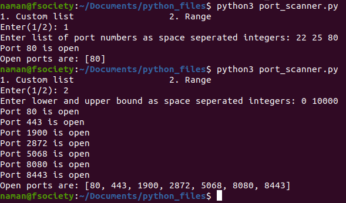

# Port Scanner with Multithreading
Python script that scans a given host IP address for open ports. Time required for the process is accelerated significantly using multithreading.

## Prerequisites
All libraries used in the script are a part of 'python standard library', no additional installs required.

## How to run the script
- Replace the `HOST-IP` in the ip_ad.cfg file with IP address of desired device
- To provide IP address as a direct input, uncomment line 84 in port_scanner.py file (and comment line 83)
- Run like any other python file (see the image for details).

## Author
[Naman Shah](https://github.com/namanshah01)
