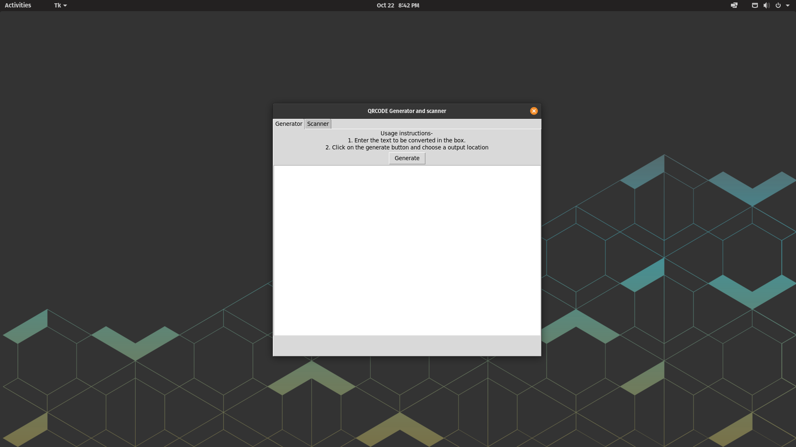
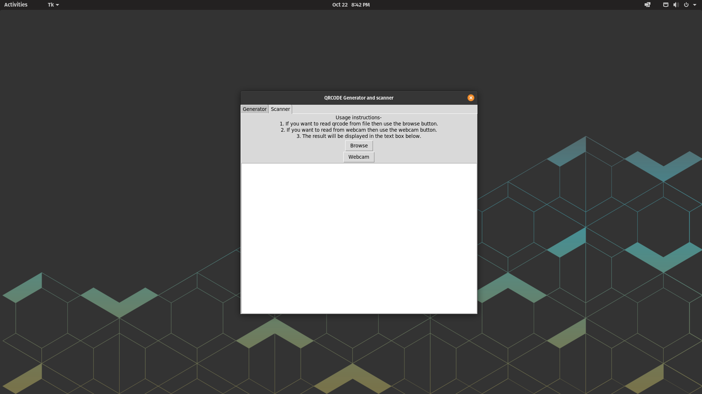

# QRCODE Generator and Scanner
---
This app will allow you to create text QRCODEs and read them from files + scan them from webcam.
I hope you will enjoy using it
Made by [Samikdevel](http://github.com/Samikdevel)

# Installation-
1. Install tkinter
2. Install pyqrcode, pyzbar, pypng and imutils-
~~~
pip install pyqrcode pyzbar pypng imutils
~~~
3. Open main.py and enjoy!

# Screenshots-

