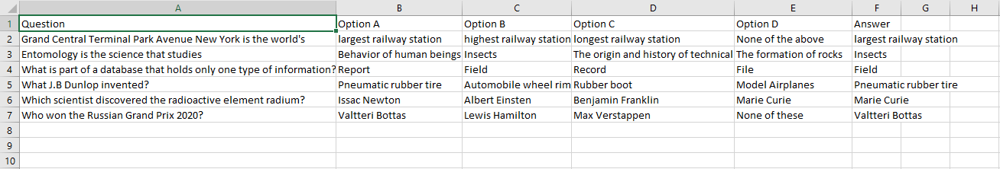
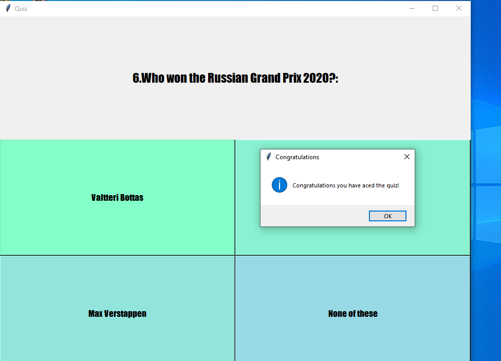
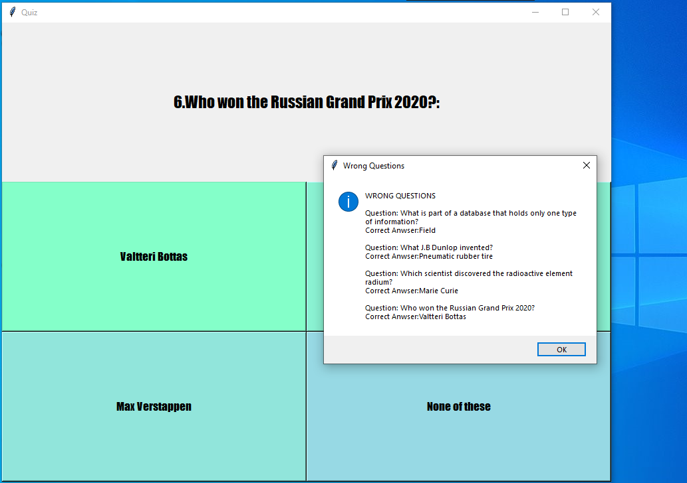

# Python Quiz Game
This is small quiz game written in python and tkinter which reads questions from a csv file.

## Requirements
Python 3.x or higher

## Usage 
```bash
python quiz.py
```

## To add more questions to the game:

Open the ```quiz_questions.csv``` file and add question, options and answers according to the column name.<br>
> (Note: While adding answer please make sure that the option exactly matches the answer)



## Quiz App Ace:


## Quiz App Wrong Questions:


## Quiz App Score:
