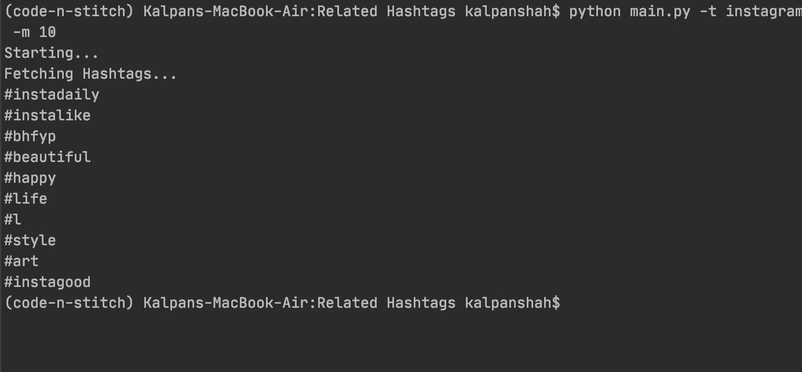
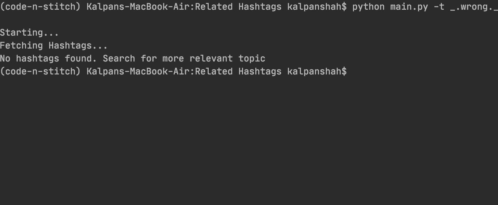

# Related Hashtags

Get popular hashtags from a particular topic


## Install

This project needs a few python packages. So you may need
to install it.


```sh
$ pip install -r requirements.txt
```

## Run


You will need a relevant topic name

```
$ python main.py -t "Your Topic"
```
> Note: You do not need to use `#` 
 

## All Arguments
Command | Description
------------ | -------------
--topic or -t | Your Username
--max-hashtags or -m | Maximum number of hashtags (default: 100)


## Example 1



## Example 2



