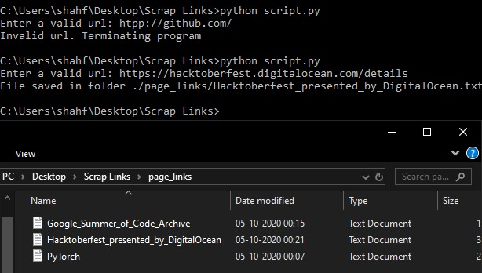

# Scraping Medium Articles
A script that scrapes all links from a given url

### Prerequisites
`pip` install the modules given in requirements.txt
 Have a working network connection on the device

### How to run the script
Run it like any other python file. Upon execution, a text file containing all the links will be saved in a folder page_links.
