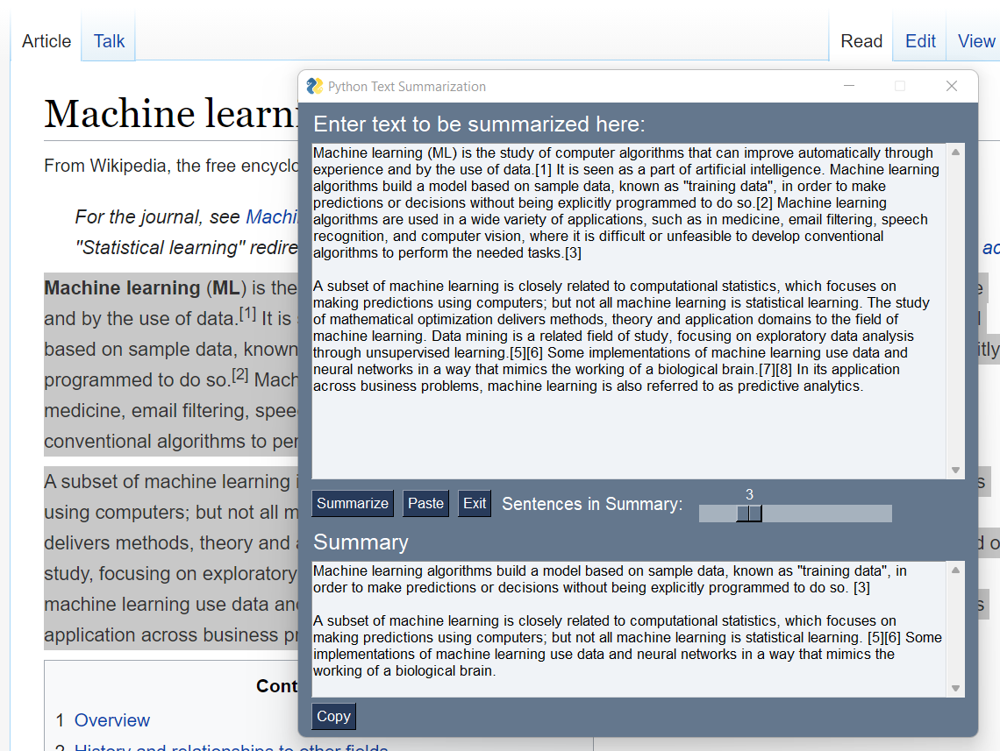

# Description

A GUI application for text summarizer that takes input as a paragraph and returns the summary of the text. You can even adjust the number of sentences using a slider!

## Requirements
Python 3.x or higher


## Usage 

Run `main.py`, input text or `paste` it from clipboard, select number of sentences using slider, press `summarize`.

```
pip install -r requirements.txt 
python main.py
```

## Screenshot



