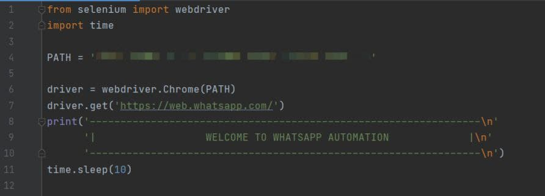
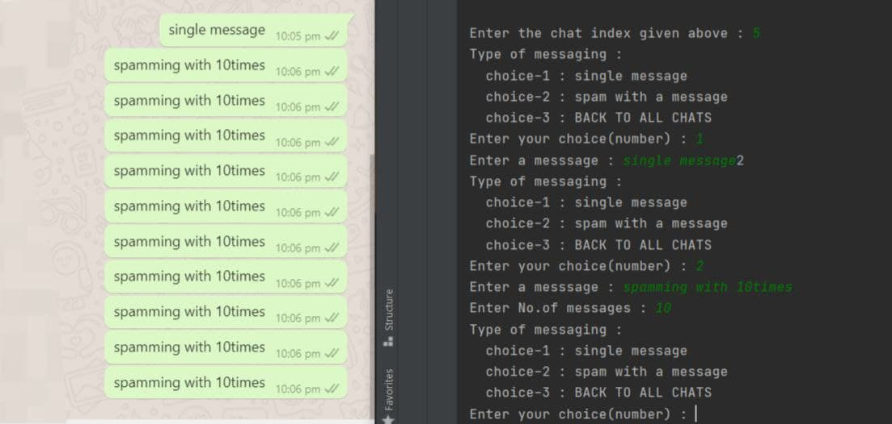

## Author : <a href="https://github.com/saisumanthkumar">sai sumanth kumar</a>

## System Requirements 
- Python Version (>3.8)

> Modules used :
- Selenium (version - 4.0.0)

> Additional Tools :
- Chrome WebDriver(version - 94.0.4606.61)
## workflow

``` bash
First replace the PATH with the path of the chrome driver.
```


``` bash
list of all contacts will appear on the command line
```


``` bash
On choosing choice-1 : single message command
```


``` bash
On choosing choice-2 : spamming with message command
```


