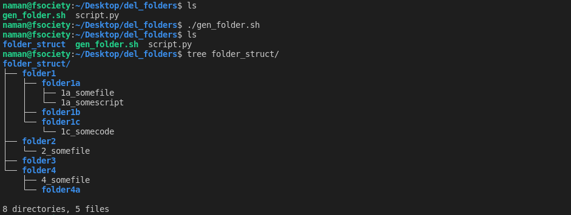
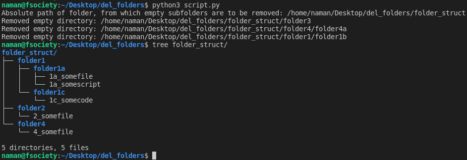

# Delete Empty Folders

Python script that deletes all empty sub folders in a given directory

## How to run the script

Generate a test directory structure using bash script `gen_folder.sh`
```bash
chmod +x gen_folder.sh
./gen_folder.sh
```

Run the python script to remove all empty folders in the directory
```bash
python3 script.py
```




## Author

[Naman Shah](https://github.com/namanshah01)