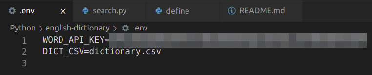
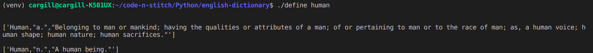
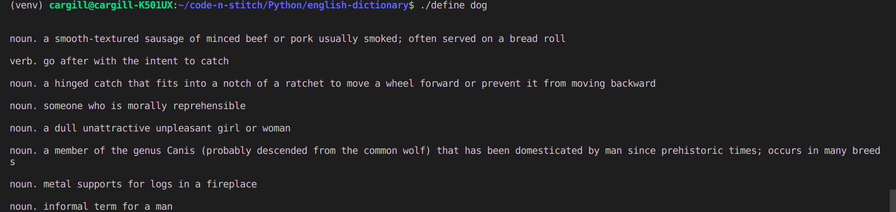
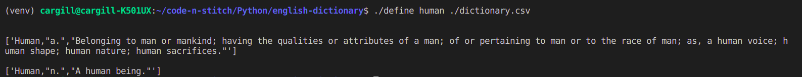
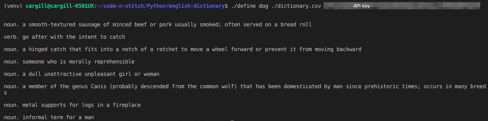

# English Dictionary

This is a simple CLI interface that defines English words from a csv file or from an API

## Preface
This was created on Ubuntu 18.04 LTS. Commands and methods may differ based on the operating system you are running.

## Instructions
1. Navigate to the `english-dictionary` directory.
2. Create virtual environment `...english-dictionary$ python3 -m venv venv`
3. Activate virtual environment `...english-dictionary$ source venv/bin/activate`
4. Install requirements `...english-dictionary$ pip3 install -r requirements.txt`
4. Define a word!
    * *[Having predefined .env file]*  
        Create `.env` file with the attributes:
        ```
        WORD_API_KEY=yourAPIKeyFromrapidapi.com
        DICT_CSV=pathToDictionaryCsv

        ```
          
        Then:
        `...english-dictionary$ ./define yourWord`.  
        **Eg:**
          
          
    * *[Enter csv path in argument and only search csv]*  
        `...english-dictionary$ ./define yourWord pathToCsv`  
        **Eg:**  
        
    * *[Enter csv path and API key]*  
        `...english-dictionary$ ./define yourWord pathToCsv APIkey`  
        **Eg:**  
          

## Source for CSV files
[Get CSV files here](https://www.bragitoff.com/2016/03/english-dictionary-in-csv-format/)

## API
[This was the API used](https://rapidapi.com/dpventures/api/wordsapi)

## Thank you! :smile:
