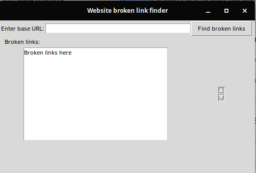
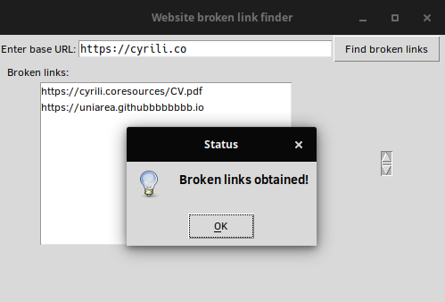

# Broken link finder

Simple tool that detects broken links in a website provided by the user.
It ignores page redirects (i.e., `href="#id"`) and preprends base address provided if relative links are detected.

## Dependencies

All dependencies are listed in the `requirements.txt` file.
Additionally, `Python tkinter` is necessary to run the GUI.
Please check the appropriate way to install it in your Operating System.

## How to run

Inside this folder, run `python3 gui.py`.

## Screenshots
### Initial status

### Website with broken links

### Website without broken links

