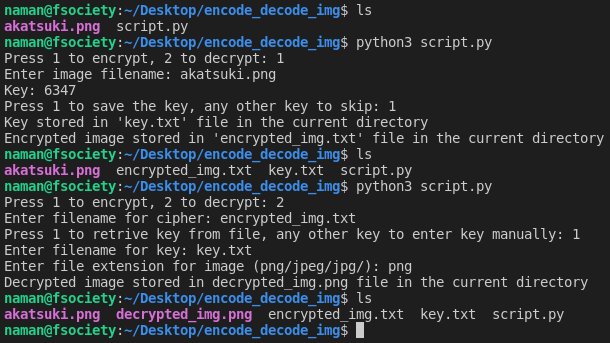

# Image Encode Decode

Python script that encodes the image by converting it to a byte stream and XORs it with a random key, and decodes it into an image again using the given key only

## How to run the script

## Author

[Naman Shah](https://github.com/namanshah01)