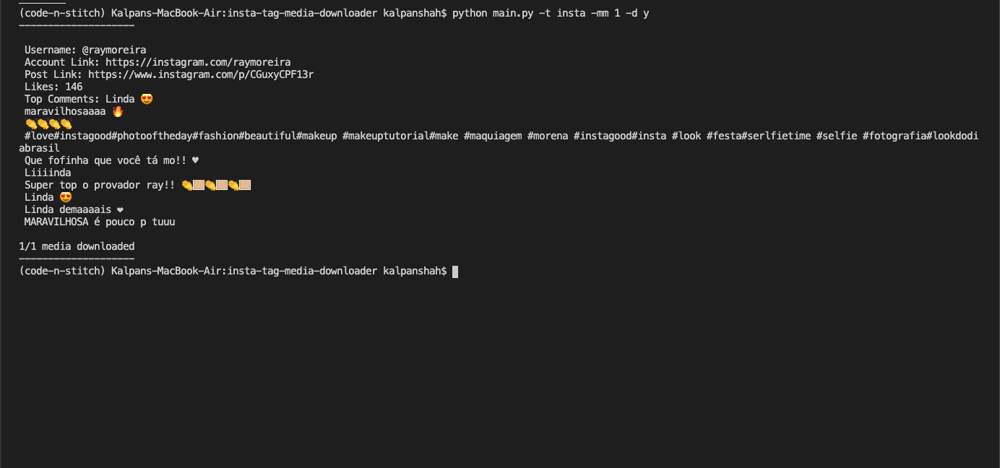
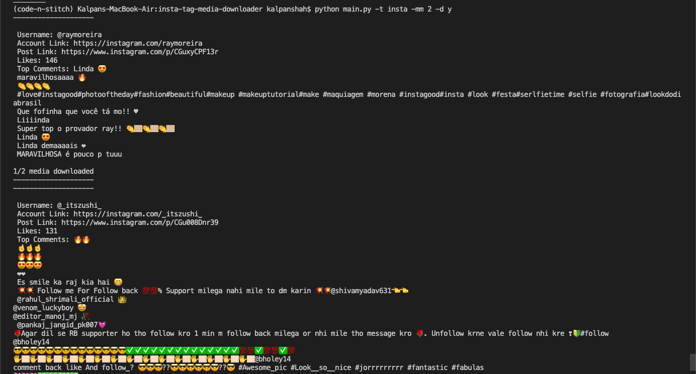

# Instagram Media Downloader via Tag

Download the top instagram medias from the hashtag


## Install

This project needs a few python packages. So you may need
to install it.


```sh
$ pip install -r requirements.txt
```

## Run


To download media pass a tag it as an argument in command line.

```
$ python main.py -tag <valid hashtag>
```
> Note: You do not need to use `#` 

## More Arguments
Command | Function
------------ | -------------
--tag | Hash Tag
--path | Path to save media
--max-media | Max number of media to download
--media-type | Preferred Media Type (`image` or `video` or `all`)
--quality | Media Quality Use either of `low`, `standard` or `high`
--download | `y` if you want download the post else `n`


## Examples






