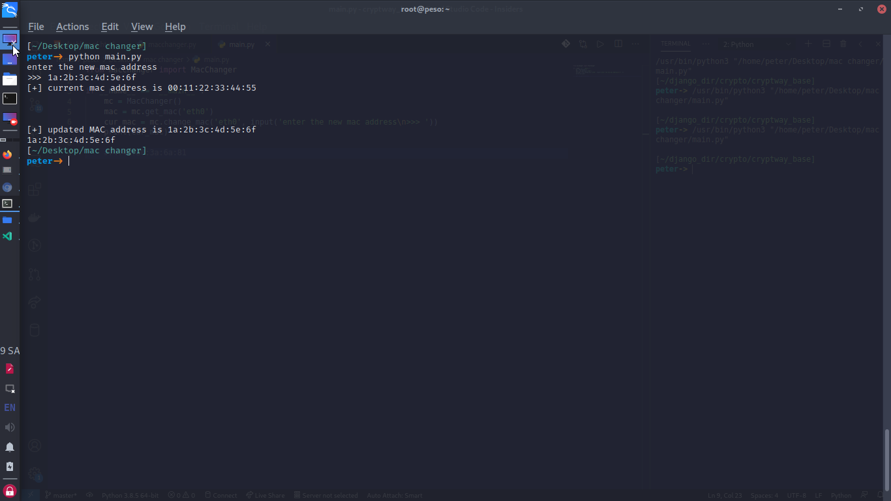

# mac address changer

this is a python program that safely changes your mac address, please ensure there is no mistake when modifying the script

## installation

you must have python installed in your computer
please visit [python](https://python.org) to install it

1. clone this repo
2. open your terminal/cmd
3. run

    ``` bash
    python main.py
    ```

4. enter your new mac address in the format below
    e.g 1a:2b:3c:4d:5a:6e

## output


