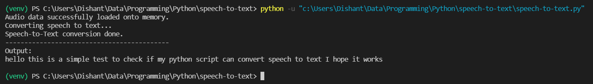

# Speech to Text Converter

This Python script converts speech from a WAVE flie to text.

The only requirement for this file to work is the `speechrecognition` library.
It can be installed using `pip install speechrecognition`

<b>Note:</b> 
If the concerned audio file is in the same directory as that of this pyscript, its filename would work as the input. If it is located in some other directory, its full absolute path needs to be given as the input.

Execution output: 

