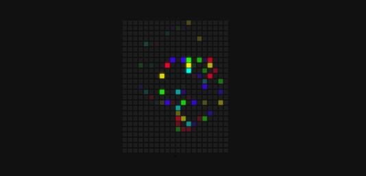

# Counter 
> This is a Hoverboard ie when you hover over the square, it will get filled with colors. This is made using Javascript, HTML and CSS.

## Setup

Simply fork this and open index.html file to view it in your browser

## Contributing

If you wish to contribute to this project

1. Fork it (<https://github.com/bislara/code-n-stitch/fork>)
2. Commit your changes (`git commit -am 'Add some fooBar'`)
3. Push to the branch (`git push origin feature/fooBar`)
4. Create a new Pull Request

Any improvements are always welcomed!