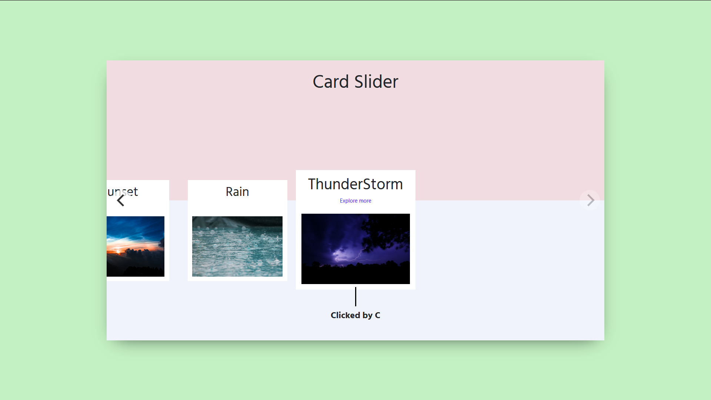
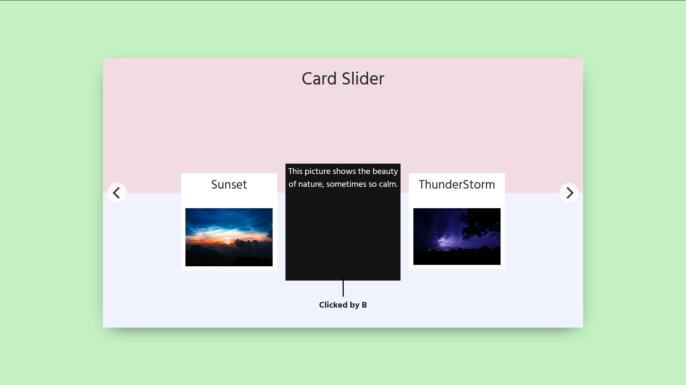

# Card Slider
> This is a Simple Card Slider built using simple HTML and CSS. 

* The Card Slider is Responsive.
* On Hover a particular Cell, The Card displays a text related to picture.
* You can change the outer Padding which is not necessary.
* Trying changing the colors, size of the cards etc. 

## Setup

Simply fork this and open index.html file to view it in your browser

## Contributing

If you wish to contribute to this project

1. Fork it (<https://github.com/bislara/code-n-stitch/fork>)
2. Commit your changes
3. Push to the branch 
4. Create a new Pull Request

Any improvements are always welcomed!
