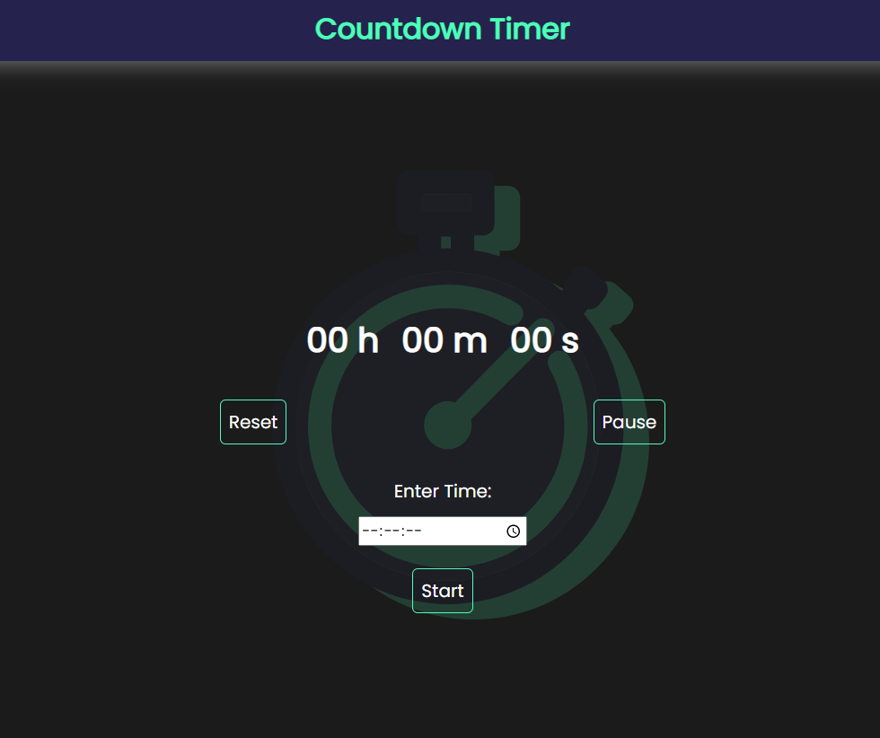

# Countdown Timer
> This is a simple Countdown Timer. It takes a deadline and indicates the completion of it.
> If you wish to reset or pause, there's an option for that too!
> And if you want to start the same timer again, you wouldn't have to set it again. Simply use 'Start Over' button

## Setup

Simply fork this and open index.html file to view it in your browser

## Contributing

If you wish to contribute to this project

1. Fork it (<https://github.com/bislara/code-n-stitch/fork>)
2. Commit your changes (`git commit -am 'Add some fooBar'`)
3. Push to the branch (`git push origin feature/fooBar`)
4. Create a new Pull Request

Any improvements are always welcomed!
