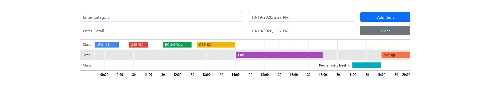

Easily create a Timeline. There are inputs for category, details, start, and end. They are all required inputs.
A few examples, a category can be `Class` and you the details for this specific entry can be `CSE 482` starting at `10:20` and ending at `11:40.`

This project was bootstrapped with [Create React App](https://github.com/facebook/create-react-app).

To run locally, go to the project directory and use `npm start` in the console. The app will then run in your browser.
