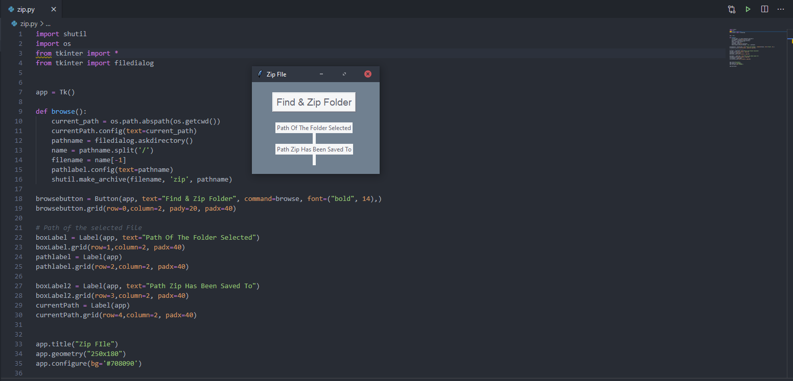

# Zip Folder
This is a Python Script used for selecting a folder and then zipping the contents of the folder

# Run
You can run this script by executing the Python File zip.py - Alternatively you can compile this script into an application by using pyinstaller. 
The command to do this would be: pyinstaller zip.py --onefile --windowed
For more information on how to use pyinstaller please see - https://pyinstaller.readthedocs.io/en/stable/

